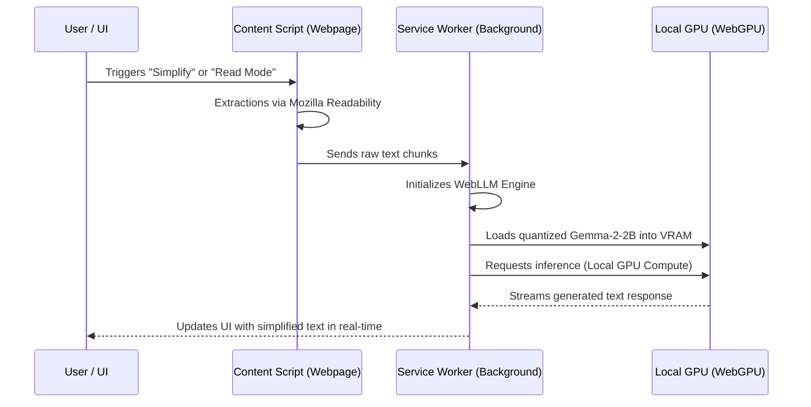

# GrayMatter Technical Pipeline & Models

This document provides a deep dive into the internal technical pipeline of the GrayMatter extension, explaining how text is processed and which AI models are utilized.

---

## 1. The AI Pipeline Architecture

GrayMatter operates on a **completely local AI pipeline**. Unlike most AI extensions that rely on external APIs (like OpenAI or Anthropic), GrayMatter runs the Large Language Model directly inside your browser using the user's local hardware.

### Flow Diagram

### Key Stages
1.  **Extraction:** The extension uses **Mozilla's Readability engine** to identify the main content of a webpage, ignoring sidebars, ads, and nav-links.
2.  **Sanitization:** Extracted HTML is passed through **DOMPurify** before being handled by the AI or displayed in Read Mode.
3.  **Inference:** The background script (Service Worker) manages the **WebLLM** engine, which acts as the bridge between the browser and the system's Graphics Card (GPU).
4.  **Streaming:** Responses are streamed via `chrome.runtime.sendMessage` ports, allowing the UI to update word-by-word as the local model generates text.

---

## 2. Models Used

GrayMatter is optimized to run small yet powerful generative models that fit within consumer-grade hardware constraints.

### Primary Model: Gemma 2 2B Instruct
*   **Developer:** Google
*   **Version:** `gemma-2-2b-it`
*   **Quantization:** `q4f16_1` (4-bit quantization optimized for WebGL/WebGPU)
*   **Why this model?** 
    - At only 2 billion parameters, it is small enough to fit into most laptop GPUs (requiring ~1.5GB to 2GB of VRAM).
    - It provides high-quality instructional follow-through for tasks like text simplification and creative rewriting.

### Engineering Stack
*   **[MLC WebLLM](https://github.com/mlc-ai/web-llm):** The core engine that provides the WebGPU-based runtime for the models.
*   **WebGPU API:** The next-generation browser API that allows the extension to access the local GPU for parallelized AI tasks.
*   **WXT Framework:** Used to manage the Manifest V3 lifecycle and maintain a persistent connection between the AI engine and the user's active tabs.

---

## 3. Hardware & Software Requirements

For the pipeline to operate effectively, the following system requirements must be met:

*   **Browser:** Latest Google Chrome (Beta or Canary recommended for best WebGPU support).
*   **GPU:** Any integrated or dedicated GPU that supports **WebGPU**. 
*   **VRAM:** Minimum 1.5 GB. 4 GB recommended for smooth multi-tasking.
*   **Memory:** 8 GB+ RAM.

---

## 4. Accessibility scoring Logic

The **Cognitive Score** is generated through a dual-input pipeline:
1.  **Readability Metrics:** Runs the **Flesch-Kincaid** formula on the text to determine the grade level complexity.
2.  **DOM Complexity:** Scans the webpage for "clutter" metrics, such as:
    - Number of fixed/sticky elements.
    - Ratio of link-text to body-text.
    - Presence of intrusive overlays.

These two factors are mathematically weighted to produce the final "Accessibility Score" seen in the extension popup.
